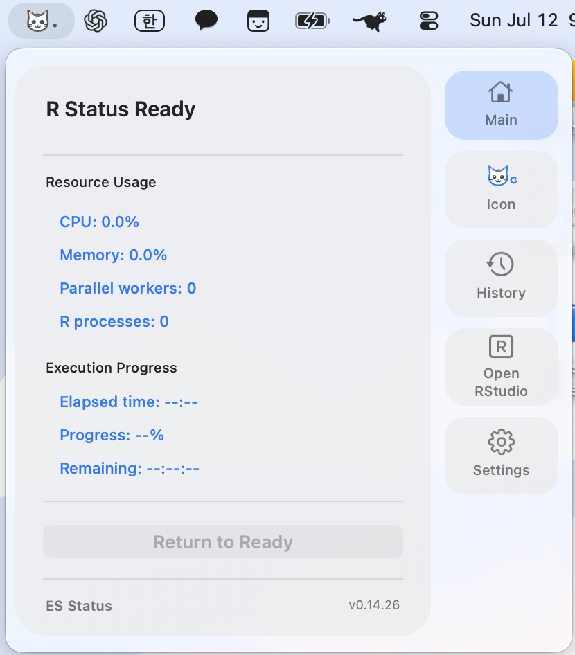
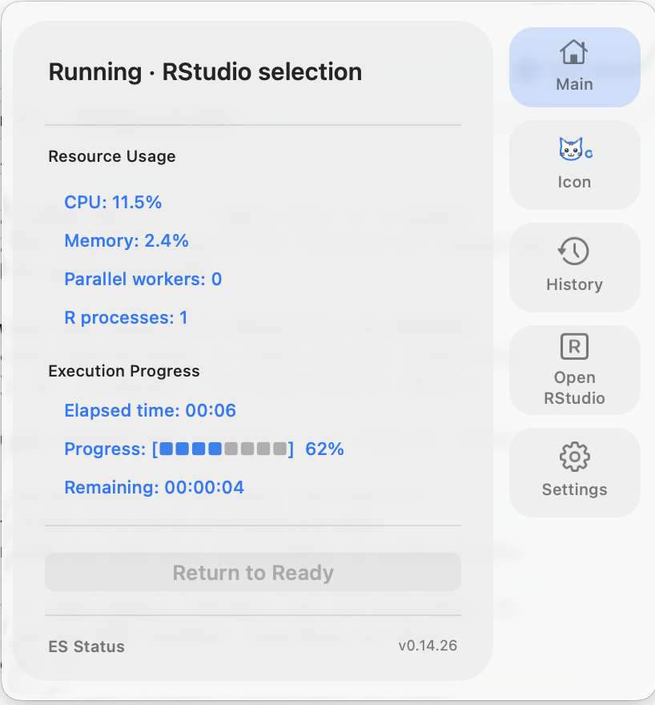
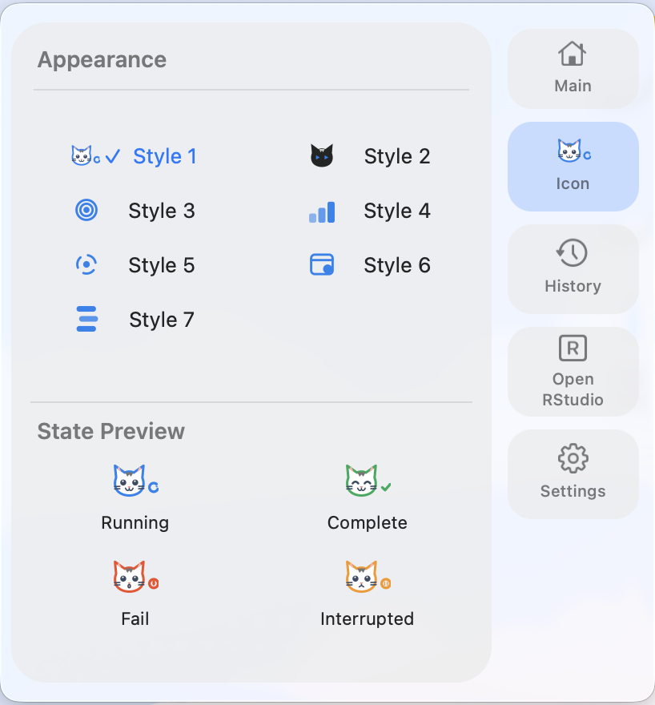
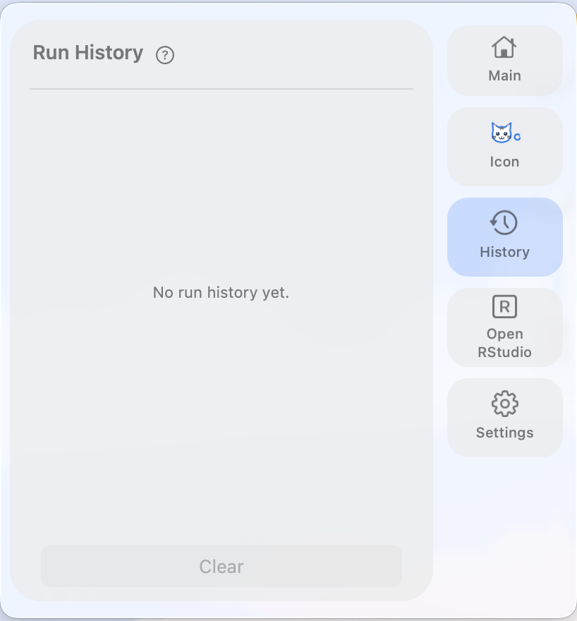
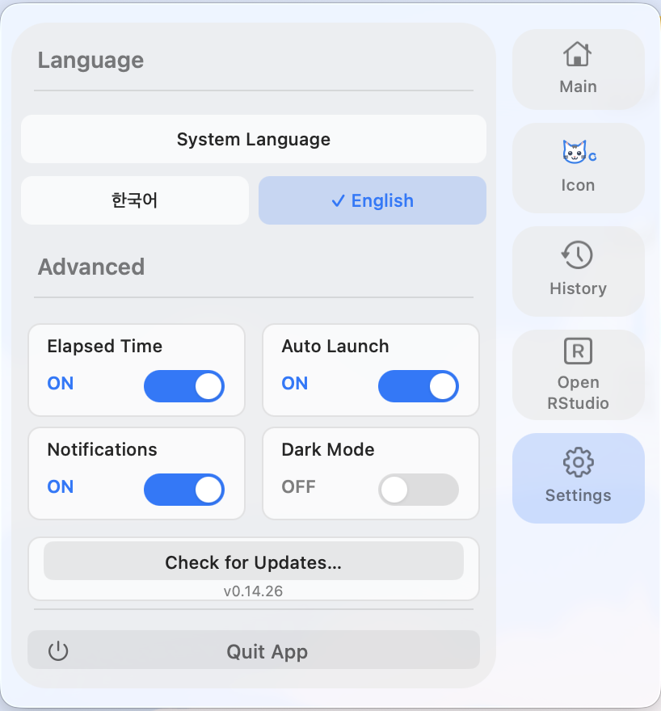

<div align="center">
  
  <h1>ES Status</h1>
  <p><strong>v0.14.26</strong></p>
  <p>RStudio에서 실행하는 R 코드의 상태와 리소스 사용량을 macOS 메뉴바에서 확인하는 Apple Silicon 앱입니다.</p>
</div>

## 주요 기능

- 실행 상태 표시: `Running`, `Complete`, `Fail`, `Interrupted`
- 실행 시간, 진행률, 남은 시간 표시
- RStudio의 CPU, Memory, 병렬 worker 및 R process 실시간 확인
- 최근 실행 기록 최대 5개 저장
- 상태별 아이콘과 7가지 아이콘 스타일
- 완료·실패·중단 시 macOS 알림
- 한국어·영어, 라이트·다크모드, 로그인 시 자동 실행
- 선택 코드 또는 현재 문서를 실행하는 RStudio Addin
- 일반 R 코드에서 사용할 수 있는 `rstatus_run()` 함수

앱과 RStudio Addin은 `127.0.0.1`을 통해서만 통신합니다. R 코드와 데이터는 외부로 전송되지 않습니다.

## 화면

<p align="center">
  
</p>

**Main** — 현재 상태, R 리소스 사용량, 실행 시간, 진행률과 남은 시간을 표시합니다.

<table>
  <tr>
    <td width="50%" align="center">
      <br>
      <strong>Running</strong><br>실행 중인 코드의 리소스와 진행률을 실시간으로 확인합니다.
    </td>
    <td width="50%" align="center">
      <br>
      <strong>Icon</strong><br>7가지 스타일과 상태별 아이콘을 미리 보고 선택합니다.
    </td>
  </tr>
  <tr>
    <td width="50%" align="center">
      <br>
      <strong>Run History</strong><br>최근 실행 시간, 최고 CPU와 최대 worker를 최대 5개까지 저장합니다.
    </td>
    <td width="50%" align="center">
      <br>
      <strong>Settings</strong><br>언어, 실행 시간, 자동 실행, 알림과 다크모드를 설정합니다.
    </td>
  </tr>
</table>

## 요구사항

- Apple Silicon Mac (`M1` 이상)
- macOS 13 Ventura 이상
- R 4.1 이상
- [RStudio Desktop](https://posit.co/download/rstudio-desktop/)
- 설치에 필요한 인터넷 연결

**Xcode와 Xcode Command Line Tools는 필요하지 않습니다.** 설치 스크립트가 GitHub Release의 사전 빌드 Apple Silicon 앱을 내려받아 SHA-256을 확인한 뒤 앱과 RStudio Addin을 설치합니다.

## 설치

설치 방법은 터미널과 ZIP 다운로드 중 하나를 선택하면 됩니다. 두 방법 모두 Xcode와 `git`을 사용하지 않습니다.

### 방법 1: 터미널

Terminal을 열고 아래 명령을 실행합니다.

```sh
curl -L https://github.com/Dev-os-elop/R-status/archive/refs/heads/main.zip -o ES-Status.zip
ditto -x -k ES-Status.zip .
cd R-status-main
chmod +x install.sh "Install ES Status.command" Resources/*.sh scripts/*.sh
./install.sh
```

### 방법 2: Download ZIP

1. 이 저장소에서 **Code → Download ZIP**을 선택합니다.
2. 다운로드한 ZIP의 압축을 풉니다.
3. 폴더 안의 **Install ES Status.command**를 더블클릭합니다.
4. macOS가 실행을 막으면 파일을 우클릭하고 **Open**을 선택합니다.

설치가 끝나면 RStudio를 완전히 종료한 뒤 다시 실행하세요. 처음 실행할 때 macOS 알림 권한을 허용하면 완료·실패·중단 알림을 받을 수 있습니다.

## RStudio에서 사용

RStudio 에디터에서 코드를 선택한 뒤 다음 메뉴를 실행합니다.

```text
Addins → Run Selection with Status
```

현재 문서 전체를 실행하려면 다음 항목을 사용합니다.

```text
Addins → Run Current Document with Status
```

정상 종료는 `Complete`, 오류는 `Fail`, Console의 **Stop** 버튼으로 중단하면 `Interrupted`로 표시됩니다.

## 예제

아래 코드를 선택하고 **Addins → Run Selection with Status**로 실행하세요. 첫 번째 `for` 루프는 Addin이 자동으로 계측하므로 Progress와 Remaining이 표시됩니다.

```r
total_steps <- 100
checksum <- 0

for (step in seq_len(total_steps)) {
  values <- matrix(rnorm(600 * 600), nrow = 600)
  gram_matrix <- crossprod(values)
  checksum <- checksum + sum(diag(gram_matrix))
}

message("Complete: ", checksum)
```

일반 R 코드에서는 작업을 `rstatus_run()`으로 감쌀 수 있습니다.

```r
library(rstudiostatus)

rstatus_run({
  model <- lm(mpg ~ wt, data = mtcars)
  saveRDS(model, "model.rds")
}, name = "Model fitting")
```

`progress` 또는 `progressr` 패키지를 사용하는 코드도 진행률과 남은 시간이 자동으로 연결됩니다.
